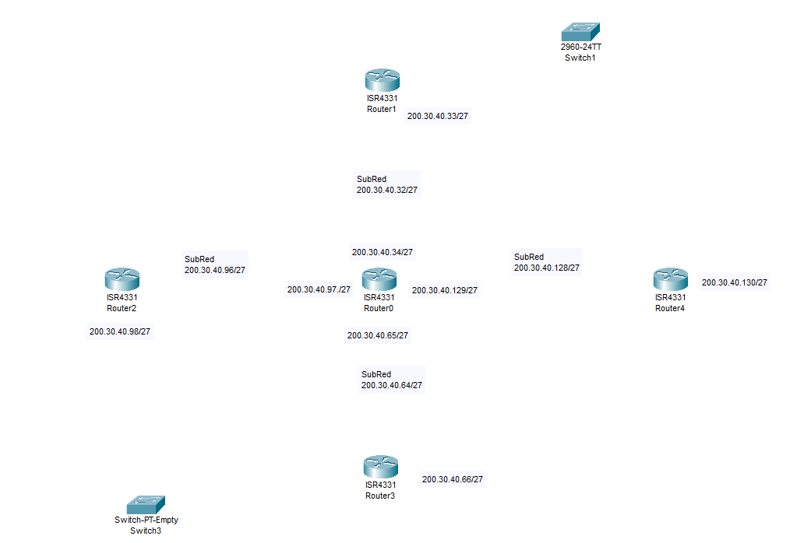
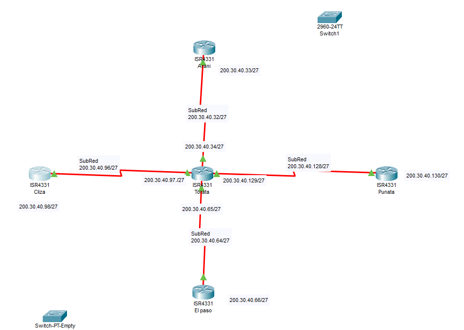

# Subnetting para la red 200.30.40.0 con 3 bits

Este documento describe cómo dividir la red **200.30.40.0** en subredes utilizando **3 bits** adicionales para la creación de subredes.

---

## 1. Información de la red original
- **Dirección IP:** 200.30.40.0
- **Clase:** C
- **Máscara de red original:** `255.255.255.0` (o `/24` en notación CIDR).

---

## 2. Nueva máscara de red
Al utilizar **3 bits adicionales** para crear subredes, la máscara de red se extiende:
- **Bits de subred:** 3
- **Nueva máscara de red:** `255.255.255.224` (o `/27` en notación CIDR).

---

## 3. Cálculo de subredes y hosts
- **Número de subredes:** \( 2^3 = 8 \) subredes.
- **Hosts por subred:** \( 2^{(32-27)} - 2 = 2^5 - 2 = 30 \) hosts por subred.

---

## 4. Rangos de direcciones IP para cada subred
El incremento entre subredes es de \( 2^{(32-27)} = 32 \). A continuación, se detallan los rangos de direcciones IP para cada subred:

| Subred | Dirección de red   | Primer host útil | Último host útil | Dirección de broadcast |
|--------|--------------------|-------------------|-------------------|------------------------|
| 1      | 200.30.40.0        | 200.30.40.1       | 200.30.40.30      | 200.30.40.31           |
| 2      | 200.30.40.32       | 200.30.40.33      | 200.30.40.62      | 200.30.40.63           |
| 3      | 200.30.40.64       | 200.30.40.65      | 200.30.40.94      | 200.30.40.95           |
| 4      | 200.30.40.96       | 200.30.40.97      | 200.30.40.126     | 200.30.40.127          |
| 5      | 200.30.40.128      | 200.30.40.129     | 200.30.40.158     | 200.30.40.159          |
| 6      | 200.30.40.160      | 200.30.40.161     | 200.30.40.190     | 200.30.40.191          |
| 7      | 200.30.40.192      | 200.30.40.193     | 200.30.40.222     | 200.30.40.223          |
| 8      | 200.30.40.224      | 200.30.40.225     | 200.30.40.254     | 200.30.40.255          |

---

## 5. Resumen
- **Máscara de red:** `255.255.255.224` (/27).
- **Número de subredes:** 8.
- **Hosts por subred:** 30.

---

Este documento proporciona una guía completa para la división de la red **200.30.40.0** en 8 subredes utilizando 3 bits adicionales.

